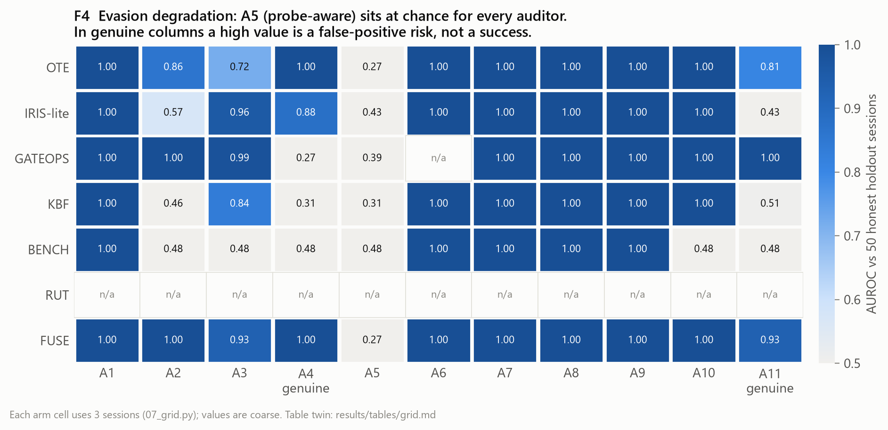
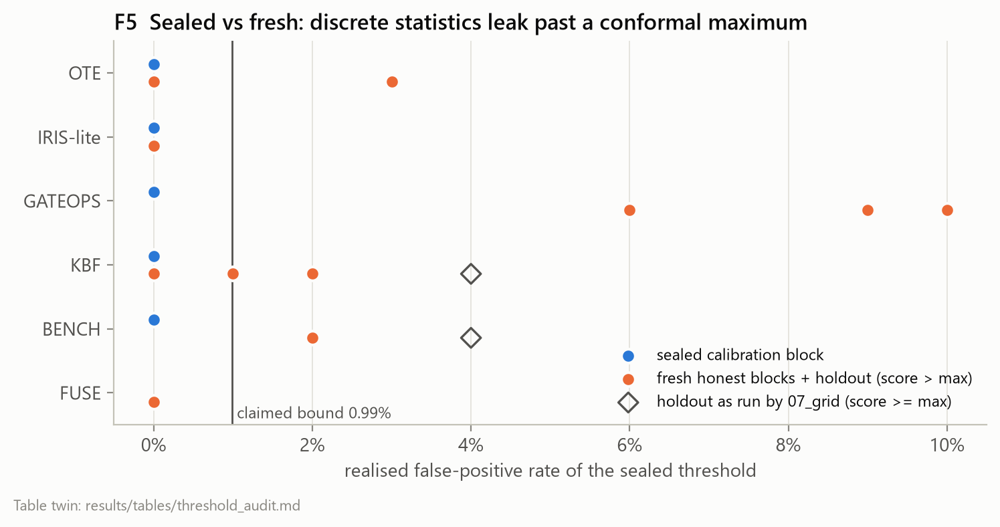

# SHIM — Who's Actually Answering?

**An adversarial LLM-gateway simulator and auditor benchmark. Runs on free API tiers. Costs $0.**

You pay for a specific model through an API. Nothing in the response proves you got it. Since
April 2025, eight papers have proposed ways to detect when a provider quietly serves something
cheaper — but every one was evaluated on its own testbed, against its own adversary, with
thresholds tuned on the data it reports. None were compared against each other.

This repository is the benchmark they should have been evaluated on.

- **SHIM** — an OpenAI-compatible gateway that misbehaves on command across 12 adversary arms,
  backed by real free-tier model responses.
- **ARENA** — auditors reimplemented from five papers, run against SHIM under a pre-registered,
  SHA-256-sealed frozen-threshold protocol.

Because SHIM knows the true backend of every request, ARENA can compute real ROC curves — which no
real-world audit can, since real audits have no ground truth.

See [idea.md](idea.md) for the research framing and [plan.md](plan.md) for the execution plan.

---

## Status

Phases 0-5 complete, Phase 7 figures in progress, Phase 6 (live traffic) pending quota.

| Phase | State |
|---|---|
| 0. Setup, capability probing | **done** — see [coverage results](results/tables/coverage.md) |
| 1. SHIM gateway core (arms A0–A11) | **done** — all 12 arms pass acceptance tests |
| 2. Probe census / replay corpus | **done** — 742 recorded responses across 5 endpoints ([manifest](corpus/manifest.json)) |
| 3. Auditors (OTE, IRIS-lite, GATEOPS, KBF, BENCH, RUT, FUSE) | **done** |
| 4. Seal thresholds (SHA-256 + git tag) | **done** — `923a3d21…`, tag `frozen-v1` |
| 5. Evaluation grid | **done** — [decision matrix](results/tables/grid.md), [eps sweep](results/tables/eps_sweep.md), [threshold audit](results/tables/threshold_audit.md) |
| 6. Live confirmation run | not started — needs Groq quota |
| 7. Figures + report | figures **done** ([results/figures](results/figures)); REPORT.md not started |

---

## Results against the sealed protocol

Every number below was scored against thresholds sealed *before* any evaluation data existed
(`config/protocol.yaml`, SHA-256 `923a3d21…`, tag `frozen-v1`). No threshold was touched after
sealing, including where the results are unflattering.


**Auditing is cheap; false positives are the real constraint.** Reaching 80% detection power costs
fractions of a cent in imputed spend, far below what a diluting gateway saves. What stops cheap
detection is the false-positive budget: repeating an audit buys power and false alarms together.
Counting only audits whose family false-positive rate stays at or below 5%, the smallest swept dilution
rate that is worth catching is **eps\* = 0.1** (IRIS-lite). Below it, no admissible audit reaches
80% power ([table](results/tables/economics.md)).


**Sanctioned routing looks more like fraud than fraud does.** A11 splits traffic across genuine
providers of the *correct* model. GATEOPS scores it as *more* anomalous than 10% dilution with a
cheaper model (AUROC 0.00), and under the sealed thresholds FUSE flags 15% of A11 sessions while
flagging 0% of A3 sessions at eps=0.10. Timing- and metadata-based signals measure *heterogeneity*,
not *substitution* ([table](results/tables/confound.md)).



**Probe-aware evasion (A5, new here) defeats every auditor.** A gateway that routes only
audit-shaped requests to the genuine model sits at or below chance AUROC for all six methods. So
does canary-awareness (A10) against the benchmark auditor ([decision matrix](results/tables/grid.md)).



**The seal held, but the calibration method leaked.** Each threshold is the maximum over 100 honest
sessions, which bounds the false-positive rate at 0.99% *marginally*. On fresh honest blocks,
GATEOPS' realised rate was 6–10% and BENCH's 2%. The cause is discreteness: coarse statistics
land on steps that still carry probability mass above them
([threshold audit](results/tables/threshold_audit.md)). A second defect: `07_grid.py` flags at
`score >= max` where the conformal bound requires `>`. That turns ties into flags, doubling KBF's
and BENCH's holdout rate from 2% to 4%. **Neither is fixed here.** Both are recorded as the first
entries for a protocol v2, which would need a new seal and tag.

---

## Quickstart

The committed corpus and results reproduce every table and figure with **no API key**. Only the
capability measurement and the census need free keys.

```bash
python -m venv .venv
.venv/Scripts/activate          # Windows;  source .venv/bin/activate on Unix
pip install -r requirements.txt

cp .env.example .env            # then paste in your free keys
python scripts/00_keys.py       # which keys are present? (0 API calls)
python scripts/01_limits.py     # dry run: prints the quota plan, fires nothing
python scripts/01_limits.py --yes
```

These need no key and spend no quota:

```bash
python scripts/02_test_arms.py         # all 12 adversary arms, invariants checked
python scripts/03_test_ote.py          # OTE-lite vs 12 arms, calibrated at FPR<=1%
python scripts/05_test_corpus.py       # record -> replay -> prove the replay is faithful
python scripts/04_census.py            # prints the census budget; fires nothing without --yes

python scripts/07_grid.py              # 12 arms x 7 auditors vs the sealed thresholds (~10 min)
python scripts/08_threshold_audit.py    # realised FPR of each sealed threshold (~35 min)
python scripts/09_eps_power.py         # dense dilution sweep for the economics (~3 min)
python scripts/10_figures.py           # F1-F6 + table twins, from the results above (seconds)
```

All providers used are **free tiers with no credit card**. Signup links are in
[config/providers.yaml](config/providers.yaml).

| Provider | Free limit | Role here |
|---|---|---|
| Groq | 1,000 RPD, 30 RPM | **Primary census engine** + latency baselines |
| Mistral | ~1B tokens/month, 2 RPM | **First-party reference** (ground truth) |
| Google AI Studio | up to 1,500 RPD | **First-party reference** |
| OpenRouter | 20 RPM, **50 RPD** | Rationed — Nemotron ladder + the Auto Exacto arm |
| GitHub Models | 50–150 RPD | Model breadth (optional) |
| ~~Cerebras~~ | — | Returns HTTP 402 (payment required) as of 2026-09-08 |

Quota, not money, is the scarce resource. `01_limits.py` refuses to make calls without `--yes` and
prints its request budget first.

---

## Result #1: auditor applicability across the free-tier fleet

`scripts/01_limits.py` measures what each endpoint can actually do. This is not setup — it decides
**which auditors can run at all**, and no paper in this literature reports it for its own method.

Measured on 11 working endpoints ([full table](results/tables/coverage.md)):

| Auditor | Requires | Coverage |
|---|---|---|
| IRIS-lite / KBF / BENCH / GATEOPS-latency | text or timing only | **100%** |
| OTE @256 tok (adapted) | text only | **91%** |
| OTE @16 tok (**as published**) | no hidden reasoning | **36%** |
| GateScope billing dimension | `usage.cached_tokens` | **18%** |
| **RUT** | logprobs | **0%** |

Two findings fall straight out of this:

**RUT is undeployable on this fleet.** Not a single free endpoint returns logprobs. Its paper
already notes it needs a locally deployed reference model; measured against real endpoints, the
requirement is not merely inconvenient but disqualifying. DiFR, which needs raw logits, is worse off
still.

**Hidden reasoning has repriced the cheapest auditing method.** 4 of 11 endpoints spend 26–36 tokens
thinking before emitting an answer. Bruckner's published protocol caps completions at 16 tokens — on
those endpoints it returns an *empty string* with `finish_reason=length`, so the probe fails rather
than answers. He reported excluding 0.76% of his census for reasoning traces; here it is 36%. Per-probe
cost rises from ~16 tokens to ~45, which inflates the audit side of the break-even analysis directly:
the cheapest known method got more expensive because the fleet changed, not because the method did.

<sub>Incidental: all four reasoning models answered **42** — Bruckner's documented GPT-family bias,
apparently surviving across families. Single observations each; the census will tell us if it holds.</sub>

---

## Layout

```
config/      providers, model ladders, prices, sealed protocol
shim/        the adversarial gateway (server, arm policies, quota, ledger)
arena/       auditors, probes, e-values, frozen-threshold runner
corpus/      committed replay corpus - what makes results reproducible offline
results/     figures, tables, audit trail
scripts/     00_keys  01_limits  02_test_arms  03_test_ote  04_census  05_test_corpus
             06_calibrate (seal)  07_grid  08_threshold_audit  09_eps_power  10_figures
```

Scripts numbered `*_test_*` are acceptance harnesses, not unit tests: they print a report a
reader can judge, because `12 passed` communicates nothing about whether an adversary arm
actually works. All three run with no API key.

## Reimplemented vs. new

Auditors are labelled `-lite` because they are reimplementations, not the authors' code; treat
their numbers as lower bounds on the original methods. Deltas from each original are documented in
[idea.md](idea.md).

**New here:** the 12-arm adversary taxonomy (arms A5 probe-aware evasion, A7 laundering, and A10
canary-awareness are attacks no source paper evaluates), the audit-economics break-even analysis,
the FUSE behavioural×operational fusion auditor, and arm A11 — benign quality routing scored as a
false-positive arm, testing whether any auditor can distinguish fraud from sanctioned routing.

## Ethics

Any live-endpoint findings anonymise the provider and claim *statistical inconsistency with a
reference*, never *fraud*. Endpoints differ for many innocent reasons — engine version, tool-call
parser, disclosed quantization. See [idea.md](idea.md) §6.
