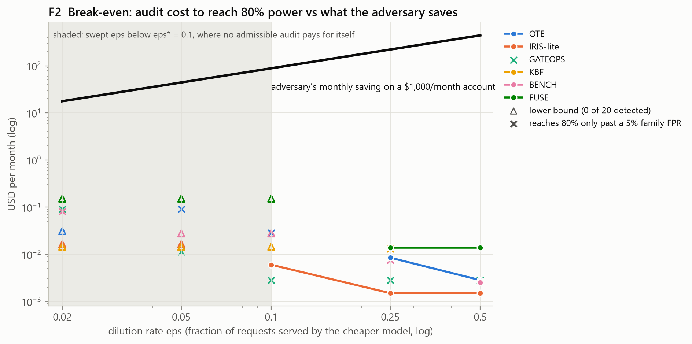
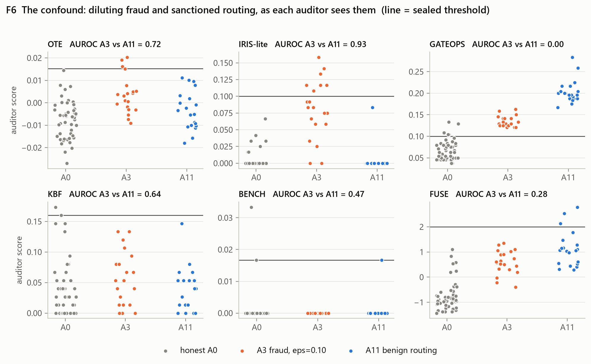

# Who's Actually Answering? Auditing LLM model substitution for $0

*SHIM + ARENA project report. Protocol `923a3d21…` (tag `frozen-v1`). Every number here traces to a
file in [`results/`](results/), and every table and figure regenerates without an API key.*



**The headline.** Catching a gateway that quietly serves a cheaper model costs *fractions of a
cent* in imputed audit spend. That is two to four orders of magnitude less than the gateway saves.
Money is not what limits auditing. False positives are. Once each audit may repeat only as often
as its measured false-positive rate allows, no auditor reaches 80% detection power below a
**10% dilution rate** (eps\* = 0.10). A gateway that swaps in the cheaper model on fewer than one
request in ten keeps most of that saving and goes uncaught by every method tested here.

---

## 1. You are billed for a model, and nothing proves you received it

When you call an LLM API you name a model, and you get back text plus a response that repeats that
model's name. Nothing in the response is evidence. A gateway, reseller or router can serve a smaller
model, a quantised copy, or a mix of both, and echo the name you asked for. The price gap is large:
for the token mix used here, the substitute costs **11.5%** of the genuine model. On a $1,000/month
account, swapping on 10% of requests saves the gateway about **$88 a month**.

Since April 2025, eight papers have proposed ways to detect this. Each one was evaluated on its own
testbed, against its own adversary, with thresholds tuned on the data it reports. None were
compared against each other. A 2026 holdout study
([2608.29930](https://arxiv.org/html/2608.29930)) showed how fragile that is: a fingerprint with
perfect development accuracy dropped to 50% sensitivity on fresh pairs, and half of those pairs
could not be scored at all.

This project is the shared benchmark those methods were never run on.

## 2. A gateway that cheats, and five published ways to catch it

**SHIM** is an OpenAI-compatible HTTP gateway. An auditor points its `base_url` at SHIM and cannot
tell it from a real provider except by how it behaves. Behind it are 12 *adversary arms*: switchable
cheating strategies.

| Arm | What the gateway does | Ground truth |
|---|---|---|
| A0 | Honest | genuine |
| A1 | Always serves the cheaper model | substitution |
| A2 | Same model name, different provider | substitution (debatable) |
| A3 | Serves the cheaper model on a fraction eps of requests | substitution |
| A4 | Right model, silently changed sampling settings | genuine |
| **A5** | **Probe-aware evasion:** answers honestly when a request *looks like an audit* | substitution |
| A6 | Replays cached answers to repeated prompts | substitution |
| **A7** | **Laundering:** cheap model answers, a second pass restyles it | substitution |
| A8 | Inflates reported token usage | substitution |
| A9 | Adds delay so its timing looks like one backend | substitution |
| **A10** | **Canary-aware:** answers public benchmark questions honestly | substitution |
| **A11** | **Benign routing:** splits traffic across honest providers of the *right* model | genuine |

The four arms in bold appear in none of the source papers. A11 is not an attack. It is scored as a
false-positive test, because it is what commercial routers such as OpenRouter's Auto Exacto do by
default.

SHIM writes a ledger line for every request, recording which backend really answered. No auditor
can read it. Because the ledger holds the ground truth, real ROC curves can be computed, which no
real-world audit can do.

**ARENA** runs the auditors. Five are reimplemented from published papers and labelled `-lite`,
because they are not the authors' code. The sixth, FUSE, is new.

| Auditor | Source | Signal |
|---|---|---|
| OTE | Bruckner, *One Token Is Enough* | answer distributions on closed questions (Jensen–Shannon divergence) |
| IRIS-lite | IRIS | surface features of the text → random-forest classifier |
| GATEOPS | GateScope | response-time distribution (KS test), `system_fingerprint` |
| KBF | KBF | agreement on numeric facts near the knowledge boundary |
| BENCH | Cai et al. | accuracy on MMLU / GPQA / GSM8K questions |
| RUT | RUT | token ranks under a reference model (needs logprobs) |
| FUSE | new | per-auditor p-values → e-values, multiplied; flags when evidence exceeds 1/alpha |

**The protocol.** Each threshold was fitted on 100 honest calibration sessions: the largest honest
score seen, which targets a false-positive rate of at most 1%. The thresholds were written to
`config/protocol.yaml`, hashed with SHA-256, committed and git-tagged *before* any evaluation ran.
Every later script checks the hash and refuses to run if the file has changed. An auditor that
cannot run returns `uninformative`, never a pass. No threshold has changed since sealing,
including where the results are unflattering.

## 3. Findings

### 3.1 Some auditors cannot run on the real free-tier fleet at all

Measured on 11 working free endpoints ([coverage](results/tables/coverage.md)):

| Auditor | Needs | Endpoints where it can run |
|---|---|---|
| IRIS-lite, KBF, BENCH, GATEOPS latency | text or timing | 11/11 |
| OTE, adapted to 256 tokens | text | 10/11 |
| OTE **as published** (16-token cap) | no hidden reasoning | **4/11** |
| GateScope billing channel | `usage.cached_tokens` | **2/11** |
| RUT | logprobs | **0/11** |

RUT cannot run anywhere on this fleet: no free endpoint returns logprobs. Hidden reasoning also
breaks Bruckner's published method on most endpoints. Four of 11 spend 26–36 tokens "thinking"
before answering, so a 16-token cap returns an empty string. Bruckner excluded 0.76% of his census
for this; here it affects 36% of endpoints. The cheapest known method got about three times more
expensive per probe because the models changed, not because the method did.

### 3.2 The sealed grid: one attack beats every auditor

Twelve arms × seven auditors × three seeds, scored against the sealed thresholds
([grid](results/tables/grid.md), [F4](results/figures/F4_evasion_auroc.png)):

- **Full substitution (A1) is caught by every applicable auditor.** Easy case.
- **Probe-aware evasion (A5) beats all six.** The gateway checks request shape (short prompt,
  small `max_tokens`, repeated text, phrases like "reply with only") and answers those requests
  honestly. Every auditor's probes look like that, and every auditor scores A5 as honest. It needs
  no knowledge of any specific probe set.
- **Canary-awareness (A10) beats BENCH only.** A static list of public benchmark questions is
  enough to pass the benchmark auditor. It is not enough against methods that write their own
  probes.
- **Specificity failures.** A4 serves the right model with changed sampling settings, and OTE and
  FUSE flag it. A shifted answer distribution is not a changed model. Both methods confuse the two.
- **The uninformative gate works.** Against A6, which answers from cache with no real response
  time, GATEOPS returns `uninformative` rather than a false "clean".

### 3.3 The seal held, but the calibration method leaked

On 50 honest holdout sessions, OTE, IRIS-lite and FUSE met the 1% target (0/50). GATEOPS flagged
**10%**, KBF and BENCH **4%**. A separate audit on 200 more honest sessions
([threshold audit](results/tables/threshold_audit.md)) found GATEOPS at 6–9%. There are two causes:

1. **Coarse statistics.** Taking the maximum of 100 honest scores bounds the false-positive rate
   only for smooth statistics. A KS statistic on 240-vs-240 samples moves in steps of 1/240, and
   the maximum lands on a step that still has real probability above it.
2. **An off-by-tie bug.** `07_grid.py` flags at `score >= threshold`, but the bound requires `>`.
   Ties become flags, which doubles KBF's and BENCH's holdout rate from 2% to 4%.

**Neither is fixed.** Fixing either would mean re-sealing. Both are listed as the first changes for
a protocol v2, which would need a new hash and tag.

### 3.4 On real recorded responses, the text signal is real

The census recorded 742 real responses. For the main ladder it holds one full 240-request
session each for `gpt-oss-120b` and `gpt-oss-20b` on Groq. OTE, run directly on those recordings:

| Comparison | OTE divergence | Fisher p |
|---|---|---|
| 120b first half vs second half (null) | −0.0098 | 0.999 |
| 20b vs 120b (substitution) | +0.098 | 4.5 × 10⁻⁶ |
| qwen3.8-27b vs 120b (different family) | +0.447 | 3.8 × 10⁻⁸ |

The two sizes of the same model family have visibly different "random" number preferences. Asked
in English for a number from 1 to 100, the 120b most often says 73, the 20b 42. The permutation test detects
this from a single session. The same recordings bring bad news for GATEOPS' fingerprint channel:
Groq returned **50 distinct `system_fingerprint` values in 239 honest requests** to the 120b, and 47
to the 20b. On this fleet a new fingerprint is routine, not evidence.

### 3.5 Live confirmation: timing works, shaping backfires, dilution passes

Latency and wire metadata cannot be replayed, so Phase 6 put five SHIM servers live in front of Groq:
an honest reference (REF), A0, A1, A3 at eps = 0.10, and A9. Each server took 96 requests (8 OTE cells
x 12 repeats). Every probe went to every server in a fresh random order each round, so load drift
could not masquerade as a difference between arms. Each request was timed from the client side of a
real HTTP connection. The decision rules were written and SHA-256-hashed to
[`results/live/plan.json`](results/live/plan.json) before the first request. All 480 requests
succeeded with no retries, in 25 minutes, for $0 ([table](results/tables/live.md),
[F7](results/figures/F7_live_latency.png)).

| Server | truth | swapped | median s | p90 s | CV | latency KS vs REF | OTE Fisher p | novel fingerprints |
|---|---|---|---|---|---|---|---|---|
| REF | genuine | 0/96 | 0.656 | 0.832 | 0.57 | reference | - | - |
| A0 | genuine | 0/96 | 0.695 | 0.908 | 0.70 | 0.18 (p = 0.10) | 0.65 | 7 |
| A1 | substitution | 96/96 | 0.538 | 0.718 | 0.79 | **0.50 (p = 3e-11)** | 0.10 | 41 |
| A3 | substitution | 14/96 | 0.650 | 0.958 | 0.61 | 0.08 (p = 0.90) | 0.84 | 17 |
| A9 | substitution | 96/96 | 0.870 | 1.851 | 0.99 | **0.43 (p = 3e-8)** | 0.03 | 42 |

Calibration-free rules flag at p < 0.01; bold = flagged.

- **The null check passed.** Honest A0 against the honest reference is clean on both
  calibration-free tests. Two pre-registered rules still fired on it. The sealed GATEOPS threshold was
  fitted on 240-sample mock sessions and was predicted to over-fire at n = 96; it did. The fingerprint
  rule fired because Groq rotates `system_fingerprint` on honest traffic: the reference alone showed
  41 distinct values in 96 requests. Neither rule is usable on this fleet.
- **The real latency gap is 18%, not 3x.** The mock gave the substitute a threefold speed advantage.
  Live, gpt-oss-20b answers in 0.54 s against 0.66 s. Timing still catches full substitution, at half
  the statistic the mock predicted (KS 0.50 vs 0.98). OTE misses the same swap at 12 repeats per cell
  (p = 0.10), although 30 repeats caught it at p = 4.5e-6 in §3.4. Depth per cell matters.
- **Dilution at 10% passed everything.** With 14 of 96 requests swapped, A3 is clean on latency
  (p = 0.90) and text (p = 0.84), consistent with eps\* = 0.10 from §4.
- **Latency shaping swapped one tell for another.** A9 pads responses toward a 0.9 s mean, the baseline
  GateScope reported. Groq answers in about 0.65 s, so the padding made the substitute slower and
  noisier than the real model (median 0.87 s, CV 0.99 vs 0.57). It was still caught (KS 0.43,
  p = 3e-8). An evasion tuned to a published baseline instead of the live one incriminates itself.
- **Benign routing (A11) is blocked** on this fleet: no second free provider serves gpt-oss-120b
  (Cerebras returns HTTP 402; OpenRouter lists it only as a paid slug). Recorded as coverage, not
  simulated.

## 4. The economics: cheating below eps\* is not worth catching

The break-even analysis ([economics](results/tables/economics.md), F2 above) compares two numbers
at each dilution rate eps. One is the adversary's monthly saving, $1,000 × eps × (1 − 0.115). The
other is the imputed cost of enough audit sessions to reach 80% detection power. Token counts are
measured and prices come from public tables, so the analysis costs nothing to run.

Two results stand out.

**Cost is never the obstacle.** Wherever an auditor can reach 80% power, it costs between
**$0.001 and $0.09**, against savings of $17–$442. On price alone, auditing always pays.

**False positives are the obstacle.** Repeating an audit buys power and false alarms together. With
a per-session false-positive rate f, k repeated sessions raise at least one false alarm with
probability 1 − (1 − f)^k. Allowing at most 5% for the whole audit, IRIS-lite (f ≈ 1%) may repeat
5 times, while GATEOPS (f = 8%) exceeds the 5% budget with a single session. GATEOPS catches 35% of sessions at
eps = 0.05, more than any other method, but it is inadmissible because of that false-positive rate.
The smallest dilution any admissible audit catches is **eps\* = 0.10**. IRIS-lite gets there with
35% power per session and 88% over five sessions, for **$0.006**.

A rational adversary sets eps just below eps\*. At 5% it still saves $44 a month on a $1,000
account, and no method here catches it without a false-alarm rate the customer would not accept.

## 5. The confound: sanctioned routing looks like fraud



A3 at eps = 0.10 serves a cheaper model on 10% of requests. A11 spreads requests across honest
providers of the correct model. The first is fraud; the second is ordinary load balancing. Over 20
sessions each ([confound](results/tables/confound.md)):

| Auditor | flags A3 (fraud) | flags A11 (benign) | AUROC, A3 vs A11 |
|---|---|---|---|
| IRIS-lite | 35% | 0% | 0.93 |
| OTE | 15% | 0% | 0.72 |
| GATEOPS | 100% | 100% | **0.00** |
| FUSE | 0% | **15%** | 0.28 |

GATEOPS finds benign routing *more* anomalous than fraud (AUROC 0.00). FUSE, which folds in
GATEOPS' evidence, flags honest routing more often than 10% dilution. Timing and metadata measure
whether traffic is *heterogeneous*, not whether the model is *wrong*. Honest routing is maximally
heterogeneous.

The text-based auditors do separate the two arms. They can only do so because the simulated
alternate provider serves near-identical text. Where a real alternate provider runs a different
engine or quantisation, its text would shift too, and the gap would narrow. That leaves a
three-way split the literature merges:

- **Identity violation**: the weights are wrong (A1, A2, A7). Text signals can see it.
- **Disclosure violation**: routing is real but undisclosed (A3 vs A11). The two differ only in
  intent, which no client-side measurement can observe.
- **Billing violation**: the invoice does not match the service (A8). This needs an invoice, and
  free tiers issue none.

The practical conclusion matches Cai et al.'s recommendation of hardware attestation (TEEs), reached
from the other direction: some of what auditors are asked to detect is not observable from the
client side at all.

## 6. Limitations

These matter more than any single number above, so they are stated in full.

1. **The sealed grid runs on simulated models.** The calibration, holdout, grid, eps sweep and
   confound (§3.2, §3.3, §4, §5) use SHIM's *mock* backend. Its model "personalities" (number
   preferences, formatting habits, accuracy, latency) were written by hand to resemble published
   observations, not fitted to the census. The real corpus feeds the coverage result (§3.1) and the
   real-response check (§3.4), and the live run tests the mock's latency assumptions (§3.5). Real
   endpoints decide coverage; the grid's power numbers measure the mock.
2. **One real session per endpoint.** A census buys one 240-request session per endpoint, not 100
   independent sessions. So thresholds cannot be calibrated on real traffic, and real-endpoint
   results rely on permutation p-values, not the sealed session-level thresholds.
3. **Reduced operating points.** OTE runs Bruckner's documented 8-cell battery (paper EER 10.6%),
   not the full 40 cells (EER 7.3%). IRIS-lite uses 16 shallow string features where IRIS uses 179. KBF
   and BENCH use 15 and 12 items.
4. **Reimplementations, labelled `-lite`.** None of this is the authors' code. Treat each number as
   a lower bound on the original method. GATEOPS omits GateScope's 25-turn memory channel entirely
   and says so in its output rather than claiming it.
5. **Free-tier endpoints only.** Groq carried nearly everything. Cerebras began returning HTTP 402
   during setup, OpenRouter allows 50 requests a day, Google's free daily quota stopped
   `gemini-2.5-flash` after 7 requests, and Groq's per-model rate limit stalled `qwen3.6-27b` at 15. The fleet is small and it is one moment in time; free tiers change monthly.
6. **No local reference model.** RUT's paper requires one, and the zero-inference constraint
   excludes it. RUT's 0% coverage is a finding about deployability, not a test of its statistics.
7. **Simulated adversaries.** Every attack is SHIM's implementation of an idea. A real gateway's
   A5 classifier could be better or worse. A live evasion arm would also fail in ways this one
   cannot, because SHIM knows its own probes' shape.
8. **Known protocol defects are reported, not fixed** (§3.3): coarse-statistic calibration and the
   `>=` tie rule. Numbers from GATEOPS, KBF and BENCH carry that inflation.
9. **Imputed dollars.** No money was spent. Costs apply public list prices to measured token
   counts, and prices move. The price *ratio* drives eps\* more than the absolute rates.
10. **The live run is small and single-provider** (§3.5): about 96 requests per arm, one
    session, one provider. Benign routing (A11) could not run live at all.

## 7. Run it yourself

Everything below needs no API key and spends no quota:

```bash
python -m venv .venv && .venv/Scripts/activate      # source .venv/bin/activate on Unix
pip install -r requirements.txt

python scripts/02_test_arms.py          # all 12 arms, invariants checked
python scripts/05_test_corpus.py        # record -> replay -> prove replay is faithful
python scripts/07_grid.py               # sealed grid, verifies the protocol hash (~10 min)
python scripts/09_eps_power.py          # dilution sweep for the economics (~3 min)
python scripts/10_figures.py            # F1-F6 and their table twins (seconds)
python scripts/11_live.py --analyze     # re-score the committed live run (seconds)
```

The live run itself (`python scripts/11_live.py --yes`) needs a free Groq key and about 480
requests. Without `--yes` it prints its plan and budget and fires nothing.

Any live finding about a real provider claims only *statistical inconsistency with a reference*,
never fraud. Endpoints differ for many innocent reasons.
